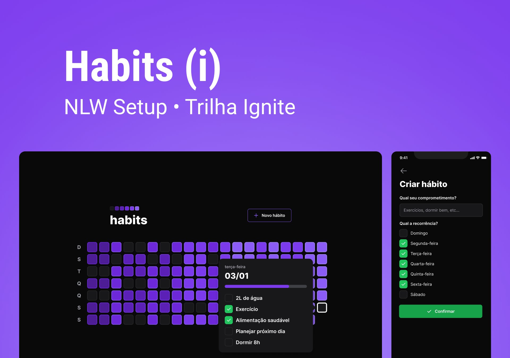

<h1 align="center">
    
</h1>

 

## 🧪 Tecnologias

Esse projeto foi desenvolvido usando as seguintes tecnologias:

- [Node](https://nodejs.org/en/)
- [React](https://reactjs.org)
- [React Native](https://reactnative.dev/)
- [TypeScript](https://www.typescriptlang.org/)
- [Fastify](https://www.fastify.io/)
- [Tailwindcss](https://tailwindcss.com/)
- [Vite](https://vitejs.dev/)
- [Expo](https://expo.dev/)

## 🔖 Layout

Você pode visualizar o layout do projeto através do link abaixo:

- [Layout Web/Mobile](https://www.figma.com/community/file/1195326661124171197)

Lembrando que você precisa ter uma conta no [Figma](http://figma.com/).

## 💻 Projeto

O projeto é um Habit tracker.

O projeto foi desenvolvido durante a **[NLW Setup](https://app.rocketseat.com.br/event/nlw-setup)**, apresentada entre os dias 16 e 20 de Janeiro de 2023.
